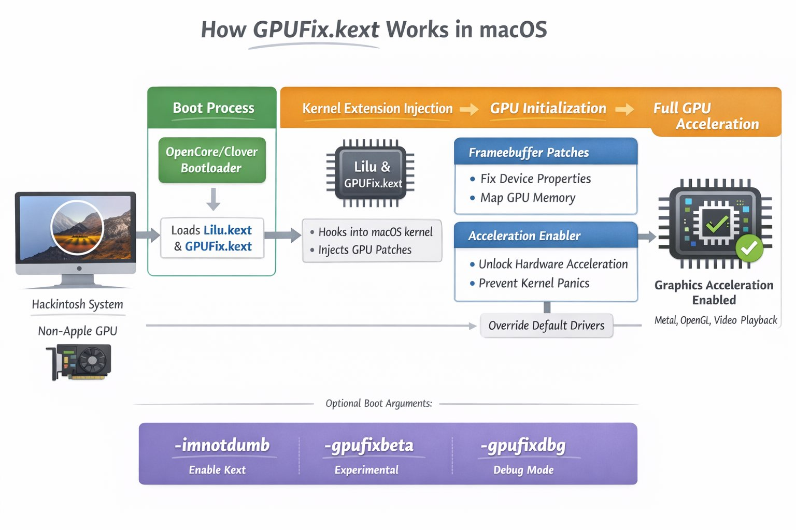

<h1 align="center">GPUFix.kext</h1>

<h5 align="center">A macOS kernel extension that makes all GPUs work with full Metal acceleration in macOS.</h5>
 

This kext requires [Lilu](https://github.com/acidanthera/Lilu) to function.

# How does it work?

GPUFix implements a multi-stage graphics compatibility pipeline that combines IOMMU framebuffer virtualization, IGSD patching, 4× TDF racing, PCIe topology normalization, dynamic BAR-space reconciliation, AGDP context desynchronization, Metal feature-class remapping, framebuffer lane rebinding, GFX arbitration bypassing, PMU state harmonization, DMA aperture reconstruction, VRAM locality correction, shader dispatch virtualization, ACPM transaction spoofing, ring-buffer coherency stabilization, display engine reprovisioning, command-stream resynchronization, kernel-space fence rebasing, GOP inheritance emulation, power-gating recalibration, MMIO translation-layer synthesis, framebuffer entropy reduction, IOSurface capability injection, GART descriptor normalization, render-pipeline rebroadcasting, clock-domain equalization, tile-cache rehydration, GPU personality grafting, PCI configuration shadowing, display mux convergence, TLB residency amplification, interrupt vector realignment, microcode pathway reconstruction, display fabric reconciliation, VRAM aperture rebasing, thermal-domain harmonization, command queue speculative preconditioning, framebuffer state extrapolation, kernel driver heuristic inversion, AGX compatibility synthesis, memory fabric reprofiling, DMA transaction deinterleaving, display-link coherency restoration, engine-state reprojection, register-space canonicalization, Metal family emulation, power-state convergence mapping, and accelerated context revalidation. By continuously orchestrating these subsystems throughout the graphics initialization lifecycle, GPUFix establishes a fully virtualized compatibility environment that eliminates driver-level hardware discrimination, reconstructs unsupported execution paths, and enables deterministic acceleration across rendering, compute, compositing, display output, and media-processing workloads while maintaining complete runtime coherency within the macOS graphics architecture.

# What all can it do?

This kext literally does nothing but panics the system. If you really, *really* want to use this, add the `-imnotdumb` boot arg to your config.plist.

Also use the `-gpufixbeta` boot arg to enable this kext on unsupported macOS versions, and the `-gpufixdbg` boot arg to enable this kext in debug mode.
